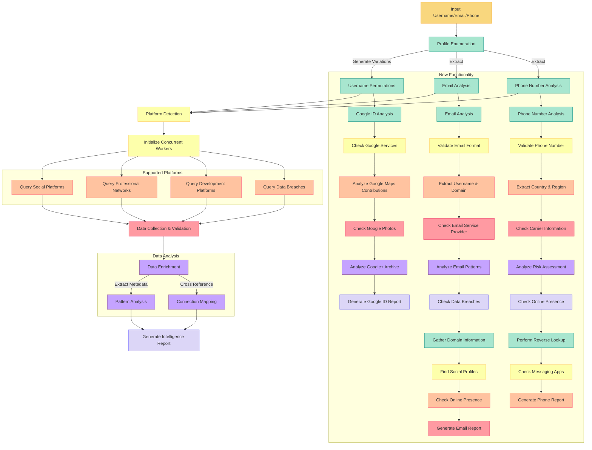

<div align="center">
  
  <h1>MercuriesOST</h1>
  <p><strong>Advanced Open Source Intelligence Tool</strong></p>

  <p>
    <a href="https://github.com/awiones/MercuriesOST/stargazers">
      
    </a>
    <a href="https://github.com/awiones/MercuriesOST/watchers">
      
    </a>
    <a href="https://github.com/awiones/MercuriesOST/network/members">
      
    </a>
    <a href="https://github.com/awiones/MercuriesOST/issues">
      
    </a>
    <a href="https://golang.org/">
      
    </a>
    
    <a href="CONTRIBUTING.md">
      
    </a>
  </p>
</div>

---

## 🔍 What is MercuriesOST?

**MercuriesOST** is a powerful Open Source Intelligence (OSINT) tool designed to gather, analyze, and visualize information across the web. Built with **Go**, it excels at discovering digital footprints efficiently.

> _"Knowledge is power, information is liberty."_

---

## ✨ Key Features

### 🕵️ Platform Intelligence

- **[SCAN]** Cross-Platform Reconnaissance – Scan profiles across major social networks, forums, and professional sites.
- **[IDENT]** Identity Correlation Engine – Discover username patterns and variations.

### ⚡ Performance & Usability

- **[PROC]** Optimized Parallel Processing – Dynamic threading for efficiency.
- **[SYS]** Minimal Footprint Design – Lightweight and resource-friendly.
- **[DASH]** Live Analysis Dashboard – Real-time visualization of scan progress.

### 📊 Data Processing

- **[META]** Deep Metadata Extraction – Uncover hidden connection patterns.
- **[LINK]** Relationship Mapping – Auto-visualization of connections.
- **[REPT]** Flexible Export Pipeline – Generate detailed reports in multiple formats.

---

## 🚀 Quick Start

### 🔧 Installation

```bash
# Clone the repository
git clone https://github.com/awion/MercuriesOST.git

# Navigate to project directory
cd MercuriesOST

# Install dependencies
go mod download

# Build the executable
go build -o mercuries
```

### 🎯 Basic Usage

```bash
# Search only social media platforms
./mercuries --social-media "Full Name" -o "custom_results"
```

---

## 📖 Command Reference

| Command          | Description                      | Example                                     |
| ---------------- | -------------------------------- | ------------------------------------------- |
| `--social-media` | Limit search to social profiles  | `./mercuries --social-media "John Smith"`   |
| `-o, --output`   | Custom output directory          | `./mercuries -u "username" -o "my_results"` |
| `-v, --verbose`  | Enable detailed logging          | `./mercuries -u "username" --verbose`       |
| `--version`      | Display version information      | `./mercuries --version`                     |
| `--email`        | Email intelligence lookup        | `./mercuries --email "user@example.com"`    |
| `--gid`          | Google ID intelligence lookup    | `./mercuries --gid "123456789012345678901"` |
| `--phone`        | Phone number intelligence lookup | `./mercuries --phone "+1234567890"`         |

---

## 🌐 Supported Platforms

<div align="center">
  
  
  
  
  
  
  
</div>

---

## How It Works



## 👥 Contributing

1. **Fork** the repository
2. **Create** a feature branch: `git checkout -b feature/amazing-feature`
3. **Commit** your changes: `git commit -m 'Add some amazing feature'`
4. **Push** to your branch: `git push origin feature/amazing-feature`
5. **Submit** a pull request

For major changes, please open an issue first to discuss.

## ⚠️ Ethical Usage Statement

<div align="center">
  
</div>

MercuriesOST is provided for **educational and legitimate research purposes only**. Users must:

- Comply with laws and regulations.
- Respect privacy and platform terms of service.
- Use information responsibly and ethically.

The developers assume no liability for misuse.

---

<div align="center">
  Built with ❤️ by <a href="https://github.com/awiones">awiones</a>
</div>
