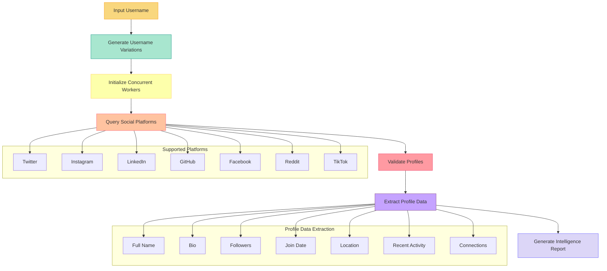

<div align="center">
  
  <h1>MercuriesOST</h1>
  <p><strong>Advanced Open Source Intelligence Tool</strong></p>

  [](https://github.com/awiones/MercuriesOST/stargazers)
  [](https://github.com/awiones/MercuriesOST/watchers)
  [](https://github.com/awiones/MercuriesOST/network/members)
  [](https://github.com/awiones/MercuriesOST/issues)
  [](https://golang.org/)
  [](LICENSE)
  [](CONTRIBUTING.md)
</div>

## 🔍 What is MercuriesOST?

MercuriesOST is a powerful Open Source Intelligence (OSINT) tool designed to gather, analyze, and visualize information from across the web. Built with Go, it excels at discovering digital footprints across major social platforms while respecting rate limits and optimizing system resources.

> *"Knowledge is power, information is liberty"*

## Key Features

### Platform Intelligence
- **[SCAN]** **Cross-Platform Reconnaissance** - Seamlessly scan profiles across major social networks, forums, and professional sites
- **[IDENT]** **Identity Correlation Engine** - Smart algorithms to discover username patterns and variations across platforms

### Performance & Usability
- **[PROC]** **Optimized Parallel Processing** - Intelligent resource allocation with dynamic threading
- **[SYS]** **Minimal Footprint Design** - Engineered for efficiency on all hardware configurations
- **[DASH]** **Live Analysis Dashboard** - Real-time visualization of scan progress and discoveries

### Data Processing
- **[META]** **Deep Metadata Extraction** - Uncover hidden connection patterns and digital footprints
- **[LINK]** **Relationship Mapping** - Automatically visualize connections between discovered profiles
- **[REPT]** **Flexible Export Pipeline** - Generate comprehensive reports in multiple analysis-ready formats

## 🚀 Quick Start

### Installation

```bash
# Clone the repository
git clone https://github.com/awion/MercuriesOST.git

# Navigate to project directory
cd MercuriesOST

# Install dependencies
go mod download

# Build the executable
go build -o mercuries
```

### Basic Usage

```bash
# Search only social media platforms
./mercuries --social-media "Full Name" -o "custom_results"
```

## 📖 Command Reference

| Command | Description | Example |
|---------|-------------|---------|
| `--social-media` | Limit search to social profiles | `./mercuries --social-media "John Smith"` |
| `-o, --output` | Custom output directory | `./mercuries -u "username" -o "my_results"` |
| `-v, --verbose` | Enable detailed logging | `./mercuries -u "username" --verbose` |
| `--version` | Display version information | `./mercuries --version` |

## 🌐 Supported Platforms

<div align="center" style="display: flex; flex-wrap: wrap; justify-content: center; gap: 10px; margin: 20px 0;">
  
  
  
  
  
  
  
</div>

## 💻 System Requirements

- **Go**: Version 1.23+ 
- **Memory**: Minimum 500MB RAM
- **Connectivity**: Internet connection required
- **OS**: Cross-platform (Windows, macOS, Linux)

## ⚙️ Smart Resource Management

MercuriesOST automatically adjusts its operation based on your system resources:

| Feature | Description |
|---------|-------------|
| **Dynamic Scaling** | 3-10 concurrent workers based on available CPU cores |
| **Memory Optimization** | Intelligent allocation with automatic throttling |
| **Rate Limit Protection** | Built-in safeguards for API limitations |
| **Connection Management** | Efficient network resource pooling |


## 🔄 How It Works

<div align="center">



</div>

## 👥 Contributing

Contributions make the open source community thrive! Here's how you can help:

1. **Fork** the repository
2. **Create** your feature branch: `git checkout -b feature/amazing-feature`
3. **Commit** your changes: `git commit -m 'Add some amazing feature'`
4. **Push** to your branch: `git push origin feature/amazing-feature`
5. **Submit** a pull request

For major changes, please open an issue first to discuss your proposed changes.

## 📜 License

<div align="center">
  This project is licensed under the MIT License - see the [LICENSE](https://github.com/awiones/MercuriesOST/blob/main/LICENSE) file for details.
</div>

## ⚠️ Ethical Usage Statement

<div align="center">
  
</div>

MercuriesOST is provided for **educational and legitimate research purposes only**. Users must:

- Comply with all applicable laws and regulations
- Respect privacy and platform terms of service
- Use gathered information responsibly and ethically

The developers assume no liability for misuse or damages resulting from the use of this software.

---

<div align="center">
  Built with ❤️ by <a href="https://github.com/awion">awion</a>
</div>
